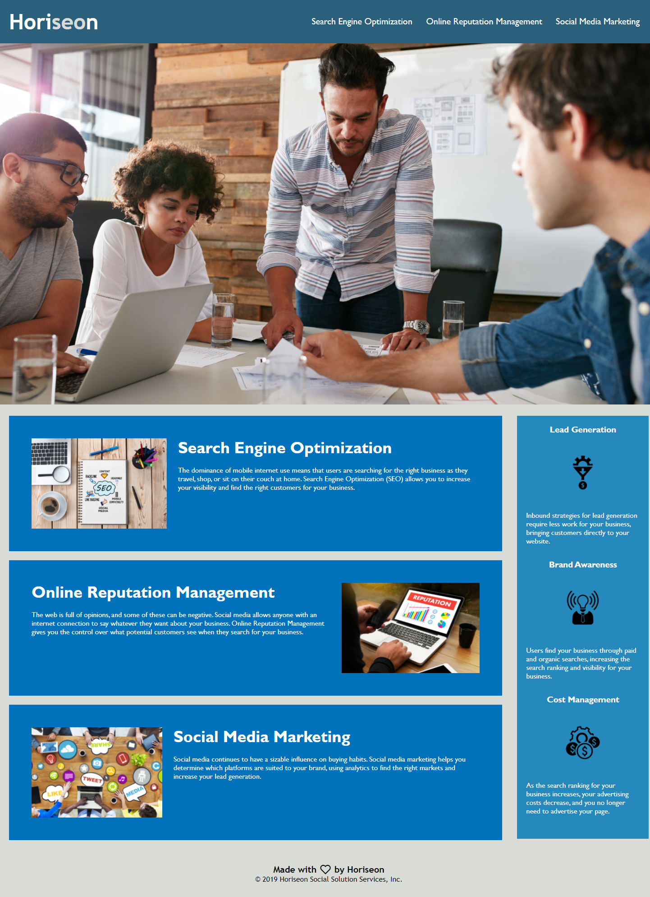

# Horiseon Landing Page (code refactor project)

## Links and screen shot
The live url to the application is : LINK HERE

## Introduction and Criteria

The accompaning application is one that attempts to be in keeping with the bellow outlined criteria:

* GIVEN a webpage meets accessibility standards

* WHEN I view the source code

* THEN I find semantic HTML elements

* WHEN I view the structure of the HTML elements

* THEN I find that the elements follow a logical structure independent of styling and positioning

* WHEN I view the image elements

* THEN I find accessible alt attributes /* I HAVE CHOSEN TO OMIT THE ALT ATTRIBUTE FOR THE HERO IMAGE, PER IT BEING A BACKGROUND IMAGE AND THUS AESTHETIC ONLY.*/

* WHEN I view the heading attributes

* THEN they fall in sequential order

* WHEN I view the title element

* THEN I find a concise, descriptive title

